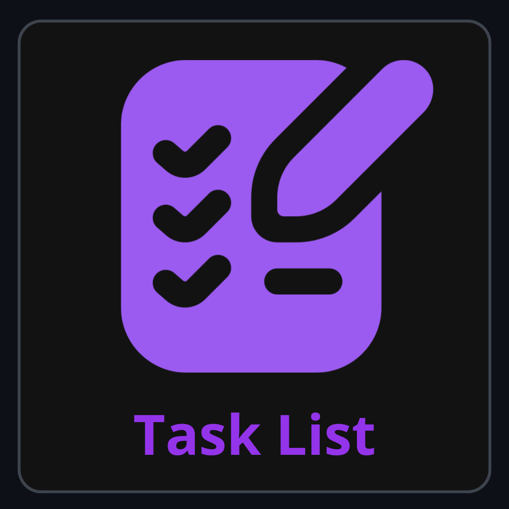

# Lista de Tarefas (Aplicativo Mobile)

## Sobre o Projeto

Este aplicativo foi desenvolvido em React Native e tem como principal objetivo auxiliar o usuário a gerenciar suas tarefas diárias. A aplicação permite adicionar, visualizar e remover tarefas de forma simples e intuitiva.

<p align="center">
  <br>
  
  <br>
</p>

---

## Tecnologias

A construção deste projeto foi baseada nas seguintes tecnologias:

- **React Native**: Framework para o desenvolvimento de aplicações móveis multiplataforma.
- **Expo**: Plataforma e conjunto de ferramentas que otimizam o desenvolvimento em React Native.
- **JavaScript**: Linguagem de programação utilizada para a lógica da aplicação.
- **Material Icons**: Conjunto de ícones para uma interface intuitiva e moderna.

---

## Principais Funcionalidades

- **Adicionar Tarefas**: Permite ao usuário inserir novas tarefas rapidamente.
- **Editar Tarefas**: Possibilidade de corrigir ou atualizar o texto de uma tarefa já existente.
- **Marcar como Concluída**: Checkbox integrado que aplica um efeito visual (riscado e opacidade) para diferenciar tarefas pendentes de concluídas.
- **Remover Tarefas**: Exclusão de tarefas específicas com sistema de confirmação nativa (Alert/Confirm).

---

## Guia de Instalação e Execução

Para executar este projeto em um ambiente de desenvolvimento local, siga as instruções abaixo.

### Pré-requisitos

Certifique-se de que os seguintes softwares estejam instalados em sua máquina:
- [Node.js](https://nodejs.org/en/) (versão LTS recomendada)
- [NPM](https://www.npmjs.com/) ou [Yarn](https://yarnpkg.com/)
- O aplicativo **Expo Go** em um dispositivo móvel (Android/iOS) para testes.

### Passos para Execução

1.  **Clone o repositório do projeto:**
    ```bash
    git clone [https://github.com/Lucas-Retanero/Lista-de-Tarefas-App.git](https://github.com/Lucas-Retanero/Lista-de-Tarefas-App.git)
    ```

2.  **Navegue até o diretório raiz do projeto:**
    ```bash
    cd Lista-de-Tarefas-App
    ```

3.  **Instale todas as dependências necessárias:**
    ```bash
    npm install
    ```

4.  **Inicie o servidor de desenvolvimento do Expo:**
    ```bash
    npx expo start
    ```

Após a execução do último comando, um QR Code será exibido no terminal. Utilize o aplicativo **Expo Go** em seu smartphone para escanear o código e carregar o aplicativo.

---

## Licença

Este projeto é distribuído sob a licença MIT. Consulte o arquivo `LICENSE` para obter mais informações.
